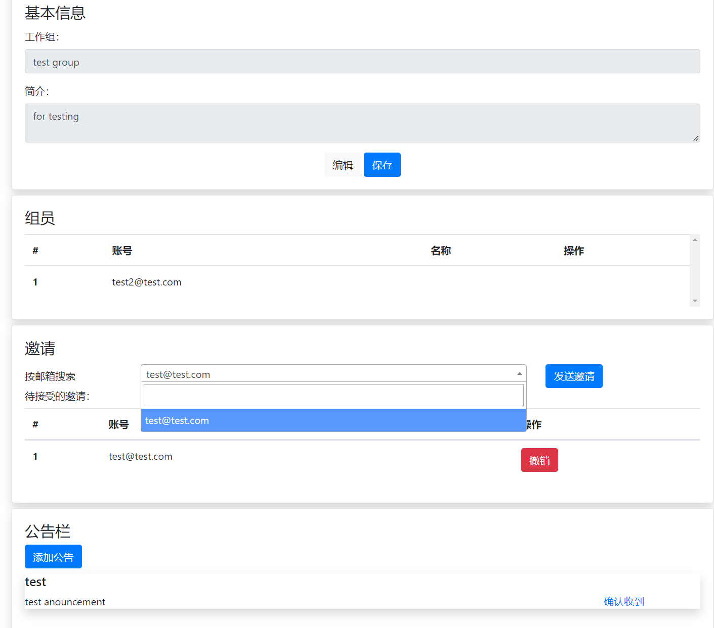
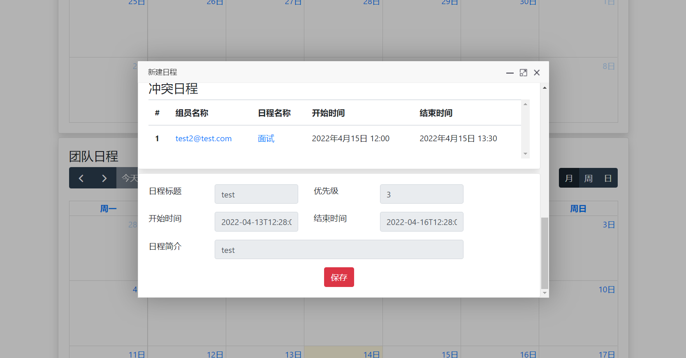
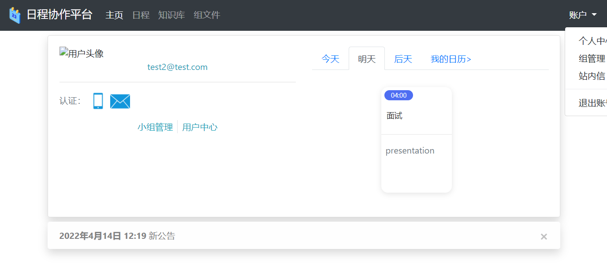
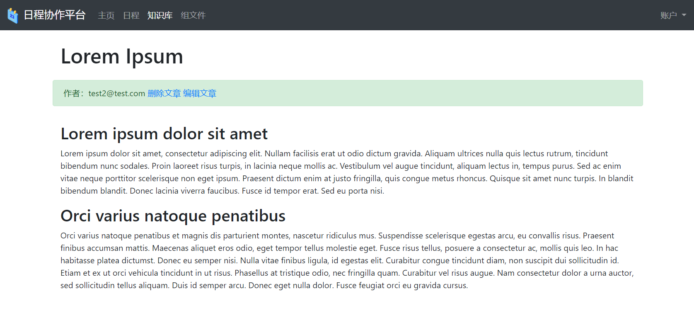
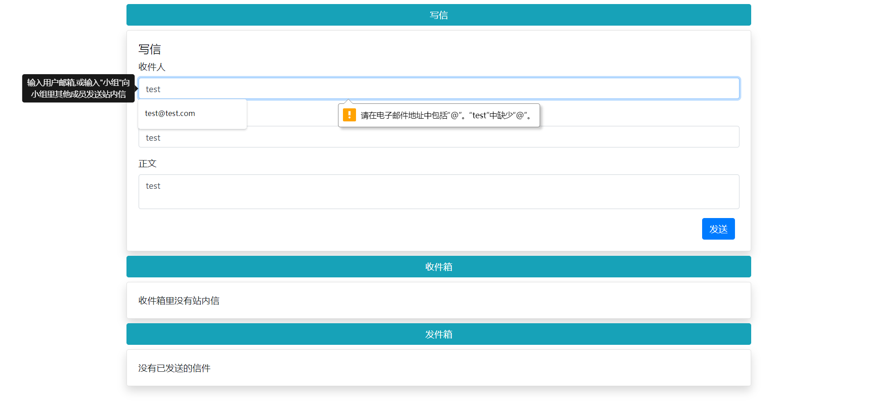
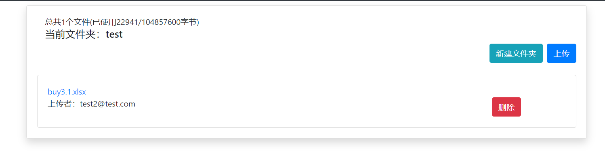

# online-work-platform

A project to learn Django.

## Getting Started

### Dependencies

* MySQL
* python >= 3.6
* Django >= 2.0
* mysqlclient >= 1.3.12

### Installing

* Make sure all the dependencies are installed
* Fetch the code - do git clone
* Set your MySQL username and password in `WorkOnline/settings.py`

### Executing program

```
python manage.py runserver
```

## Features

1. User registration, user authentication and group management



2. Personal calendar, group calendar and conflict warning.



3. Information integration at the home page



4. Group article module that support *Markdown*



5. Inter-user messaging module



6. Simple file system for sharing within groups.

